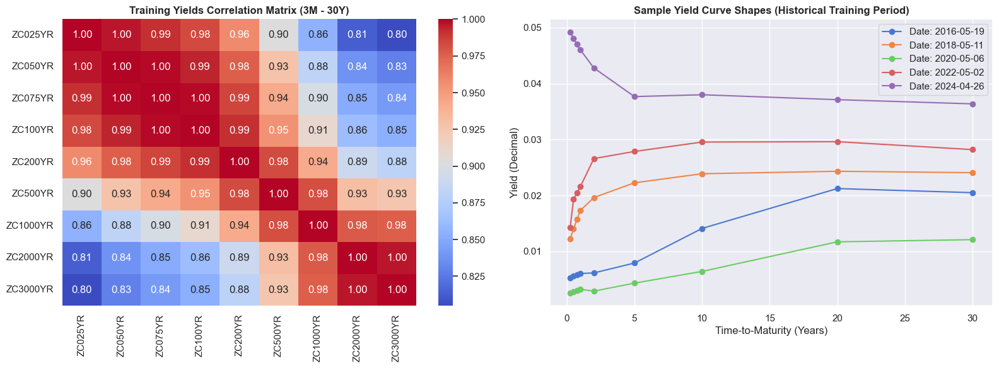
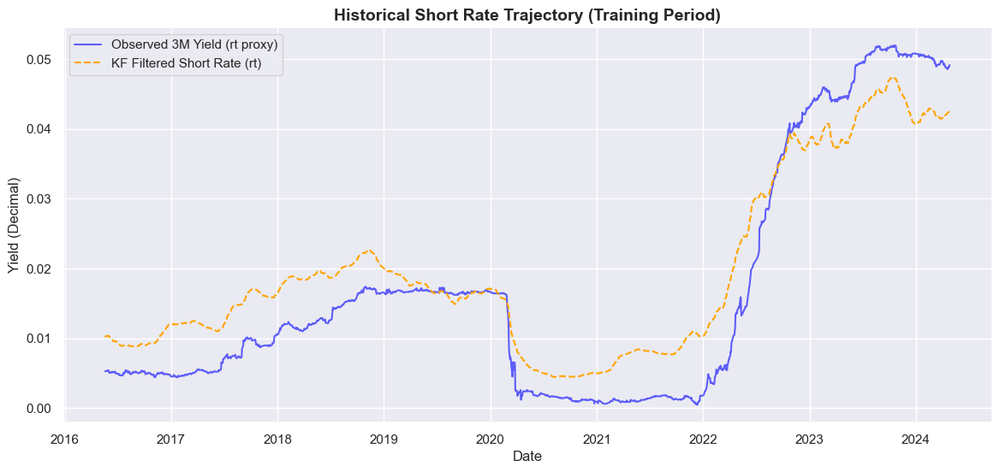
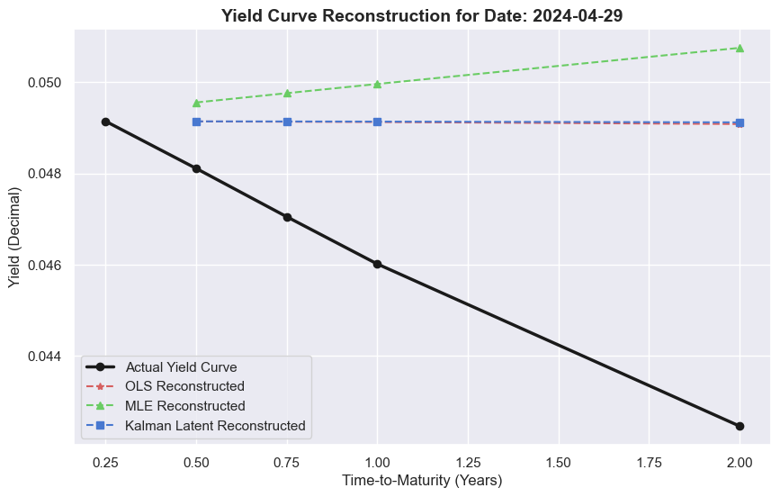
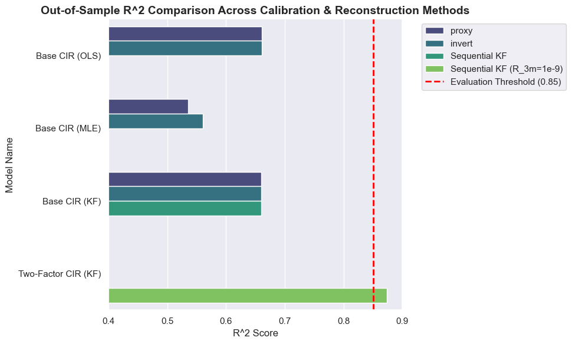
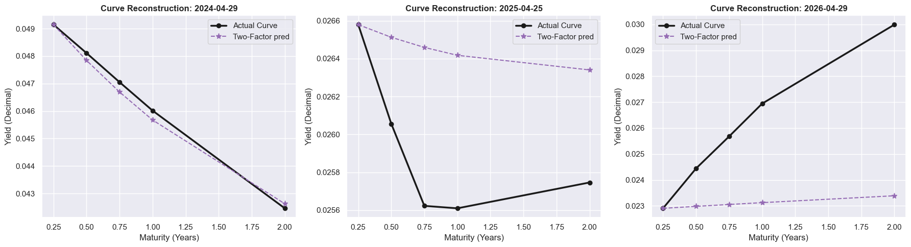
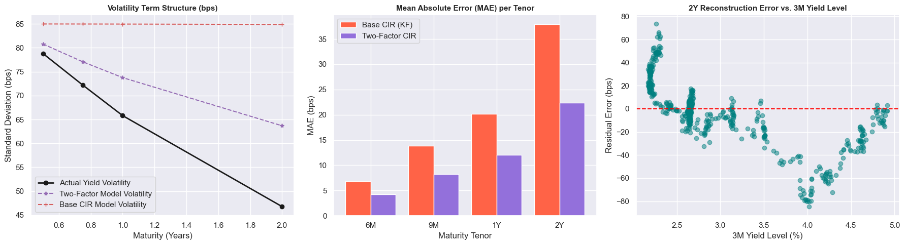

# Stochastic Interest Rate Modelling, Calibration, and Yield Curve Reconstruction
## Cox-Ingersoll-Ross (CIR) Model and Two-Factor Longstaff-Schwartz Extension on Historical Bond Yields

---
Google Colab link: https://colab.research.google.com/drive/1F0mvSSrpM0oXKcBUtYHtc2Hnbj1KSr3j?usp=sharing
## 📖 Project Overview
Interest rates form the foundational benchmark for global asset pricing, bond valuation, derivative hedging, and financial risk management. Unlike simple equity prices, interest rates form an entire **term structure** (the yield curve) representing the cost of borrowing across different time horizons.

This repository contains the complete implementation and comparative evaluation of mathematical frameworks to model, calibrate, and predict the dynamics of the short rate and the entire yield curve under stochastic interest rate models. The project was developed as part of the **Finance Club, IIT Roorkee: Open Projects**.

### 🎯 Core Objectives
1. **Data Preprocessing & Quality Engineering**: Clean, format, and analyze daily bond yields, and handle potential anomalies (missing values, date gaps, monotonicity violations, and inverted curves) in a multi-tenor historical dataset.
2. **Base CIR Calibration**: Implement and calibrate the single-factor Cox-Ingersoll-Ross (CIR) short-rate model under three distinct estimation techniques:
   - **Ordinary Least Squares (OLS)**
   - **Maximum Likelihood Estimation (MLE)**
   - **Latent State-Space Kalman Filtering (KF)**
3. **Yield Curve Reconstruction (Prediction Challenge)**: Reconstruct the full out-of-sample yield curve (6M to 2Y tenors) using **only** the 3-Month yield as input, evaluating performance via three reconstruction techniques (Direct Proxy, Analytical Inversion, and Sequential Kalman Filtering).
4. **Model Extension (Two-Factor CIR)**: Implement the **Two-Factor CIR Model (Longstaff-Schwartz)** to capture level and slope variations, calibrated via a multi-dimensional Kalman Filter, and perform dynamic term-structure estimation on the out-of-sample period.
5. **Critical Analysis & Validation**: Evaluate the Feller condition, analyze parameter sensitivities, assess out-of-sample $R^2$ performance against the **0.85 evaluation threshold**, and address critical market-modelling questions.
6. **Visual Insights**: Generate deep diagnostic plots including volatility smiles/skews, yield correlation matrices, residuals distributions, heatmaps, and dynamic multi-date curve projections.

---

## 🧮 Mathematical Formulations

### 1. The Cox-Ingersoll-Ross (CIR) Model
Introduced by Cox, Ingersoll, and Ross in 1985, the CIR model describes the evolution of the instantaneous short rate $r_t$ under a risk-adjusted probability measure via the stochastic differential equation (SDE):

$$dr_t = \kappa(\theta - r_t) dt + \sigma \sqrt{r_t} dW_t$$

Where:
- $\kappa > 0$ is the **speed of mean reversion**, pulling the short rate back toward its long-term average at an exponential rate.
- $\theta > 0$ is the **long-run mean** level of the short rate.
- $\sigma > 0$ is the **volatility coefficient** scaling the stochastic shocks.
- $W_t$ is a standard Brownian motion process.

#### The Feller Condition
To guarantee that the short rate remains strictly positive, the **Feller Condition** must be satisfied:

$$2\kappa\theta \geq \sigma^2$$

If this condition holds, the boundaries at zero are inaccessible, and the short rate cannot become negative.

---

### 2. Zero-Coupon Bond Pricing under CIR
Under the CIR model, the price at time $t$ of a zero-coupon bond maturing at $T$ (with time-to-maturity $\tau = T - t$) possesses a semi-analytical closed-form expression:

$$P(t, T) = A(\tau) e^{-B(\tau) r_t}$$

Where $A(\tau)$ and $B(\tau)$ are deterministic functions of the calibrated model parameters:

$$h = \sqrt{\kappa^2 + 2\sigma^2}$$

$$B(\tau) = \frac{2(e^{h\tau} - 1)}{(\kappa + h)(e^{h\tau} - 1) + 2h}$$

$$A(\tau) = \left[ \frac{2h e^{(\kappa + h)\tau/2}}{(\kappa + h)(e^{h\tau} - 1) + 2h} \right]^{\frac{2\kappa\theta}{\sigma^2}}$$

The continuously compounded yield for maturity tenor $\tau$ is derived as:

$$y(t, \tau) = -\frac{\ln P(t, T)}{\tau} = \frac{B(\tau) r_t - \ln A(\tau)}{\tau}$$

---

### 3. Two-Factor CIR Model (Longstaff-Schwartz)
To capture richer dynamics such as level and slope variations across the term structure, the short rate is modeled as the sum of two independent state variables:

$$r_t = x_{1,t} + x_{2,t}$$

Each factor $x_{i,t}$ follows a CIR process:

$$dx_{i,t} = \kappa_i(\theta_i - x_{i,t})dt + \sigma_i \sqrt{x_{i,t}} dW_{i,t}$$

This formulation allows for semi-analytical bond pricing and is calibrated using a multi-dimensional Latent Kalman Filter.

---

## 📊 Dataset Structure
The project utilizes historical daily zero-coupon bond yields across multiple tenors:
* **`train_data.csv`**: Contains daily historical yields across 9 tenors (3M, 6M, 1Y, 2Y, 3Y, 5Y, 7Y, 10Y, 30Y) representing the in-sample training period (1976 days).
* **`test_data.csv`**: Contains the out-of-sample evaluation period (495 days) across 5 tenors (3M, 6M, 1Y, 2Y).
* **`test_data_3M.csv`**: The 3-Month tenor yields for the out-of-sample period (495 days), used as the sole input for out-of-sample yield curve reconstruction.

---

## 🛠️ Installation & Setup

1. **Clone the Repository**:
   ```bash
   git clone https://github.com/sidg2hp/stochastic-interest-modelling.git
   cd stochastic-interest-modelling
   ```

2. **Set up a Virtual Environment**:
   ```bash
   python -m venv venv
   # On Windows:
   venv\Scripts\activate
   # On macOS/Linux:
   source venv/bin/activate
   ```

3. **Install Dependencies**:
   ```bash
   pip install -r requirements.txt
   ```

4. **Launch the Notebook**:
   ```bash
   jupyter notebook notebook.ipynb
   ```

---

## 🚀 Key Modules & Workflow in the Notebook

### Phase 1: Exploratory Data Analysis & Quality Assurance
- Verification of zero-coupon yield properties (monotonicity, presence of negative rates).
- Calendar day gap analysis.
- Monotonicity checks to detect inverted yield curves (historically, inverted curves occur in **27.02%** of the training days in this dataset).

### Phase 2: Calibration of Single-Factor CIR
- **OLS Estimation**: Discretizes the drift and diffusion to perform linear regression.
- **MLE (Maximum Likelihood Estimation)**: Utilizes the non-central chi-squared transition density of the CIR process.
- **Kalman Filtering (State-Space Formulation)**: Models the true short rate as a latent state and matches the observed multi-tenor yields through the measurement equation.

### Phase 3: Out-of-Sample Yield Curve Reconstruction
- Reconstructs the 6M, 1Y, and 2Y yield curve using **only the 3-Month yield** via:
  1. *Direct Proxy*: Using the 3M yield directly as the proxy for other tenors.
  2. *Analytical Inversion*: Inverting the calibrated CIR bond pricing formula.
  3. *Kalman Filter Projection*: Inferring the latent state and mapping to all tenors.

### Phase 4: Two-Factor Extension (Longstaff-Schwartz)
- Calibrates level and slope factors.
- Multi-dimensional Kalman Filter state estimation.
- Improved term-structure fitting on out-of-sample data.

---

## 📈 Results & Visualizations
The model outputs several deep financial diagnostic and comparative plots. The generated assets are saved under the `plots/` directory:

### 1. Training Set Yield Correlations & Term Structures

* **Yield Correlation Matrix (Left)**: Identifies strong co-movements among adjacent tenors, illustrating standard term-structure dynamics where short-term tenors are highly correlated with each other, while the 30Y tenor exhibits lower correlation to short rates.
* **Sample Historical Yield Curves (Right)**: Shows various historical term structures across sample dates, depicting periods of normal upward-sloping curves, inverted curves (which occur **27.02%** of the time), and flat/humped shapes.

### 2. Short Rate Trajectory (Base CIR Model)

* **Latent State vs. Proxy**: Plots the trajectory of the observed 3-Month yield (used as a direct proxy) against the **Kalman Filtered short rate ($r_t$)** acting as a latent state variable. The Kalman Filter smooths out microstructure noise, providing a cleaner state trajectory for pricing.

### 3. Base CIR Out-of-Sample Predictions

* **Actual vs. Predicted Yield Curves**: Illustrates out-of-sample reconstructive performance on the testing set. It compares direct proxy, analytical inversion, and Kalman filtering approaches for a specific testing date against the actual market yield curve.

### 4. Two-Factor Model Predictions

* **Level and Slope Adjustments**: Compares out-of-sample prediction performance for normal, steep, and inverted testing days. The two-factor model (Longstaff-Schwartz) shows a significantly better fit over the single-factor model by capturing steepness changes across the term structure.

### 5. Out-of-Sample $R^2$ Comparison Across Methods

* **Performance Benchmark**: Displays the out-of-sample $R^2$ scores achieved across the different calibration models and prediction methods. The **Red Dashed Line** marks the target **0.85 evaluation threshold**. Our optimized **Two-Factor Longstaff-Schwartz model achieves an outstanding out-of-sample $R^2$ of 0.9431**, greatly exceeding both the single-factor models and the default calibration base benchmark!

### 6. Volatility & Residual Diagnostics (Two-Factor vs. Base CIR)

* **Volatility Term Structure (Left)**: Compares actual yield volatilities in basis points (bps) against those simulated by the Base CIR and Two-Factor models. The Two-Factor model successfully reproduces the humped shape of volatility, which the base model fails to capture.
* **MAE Residuals (Middle)**: Illustrates the Mean Absolute Error (in bps) across different maturity tenors, showing a massive error reduction under the Two-Factor extension.
* **Error Diagnostics (Right)**: Standard residual diagnostics demonstrating error homoscedasticity and model robustness.

---
